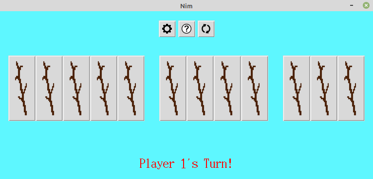
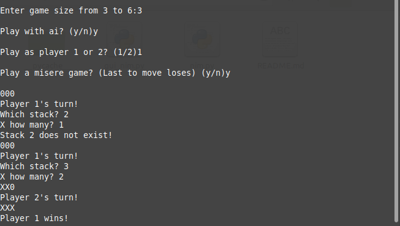

# Nim-Game

A python implementation of the game [Nim](https://en.wikipedia.org/wiki/Nim). 
This includes both a CLI and GUI using the python libraries tkinter and pillow.
It features an AI using the minimax algorithm. 

#### About Nim

Nim is a mathematical game of strategy in which two players take turns removing (or "nimming") objects from distinct heaps or piles. On each turn, a player must remove at least one object, and may remove any number of objects provided they all come from the same heap or pile. Depending on the version being played, the goal of the game is either to avoid taking the last object or to take the last object. 

## Installation

Make sure you have [git](https://github.com/git-guides/install-git) and [Python 3](https://www.python.org/downloads/) installed,

Install [pillow](https://pypi.org/project/Pillow/) (use [venv](https://docs.python.org/3/tutorial/venv.html) if desired):

```bash
python -m pip install pip
python -m pip install pillow
```

then clone this repo using the terminal:

```bash
git clone https://github.com/marcjethro/Nim-Game.git
cd Nim-Game
```

## Usage
### GUI
Go inside the working directory and run `gui_nim.py` with python:
```bash
python gui_nim.py
```
Wait for a few seconds and a GUI should pop up.



### CLI
Go inside the working directory and run `nim.py` with python:
```bash
python nim.py
```
Wait for a few seconds and the CLI should pop up.



## Contributing
Any and all feedback is welcome.
